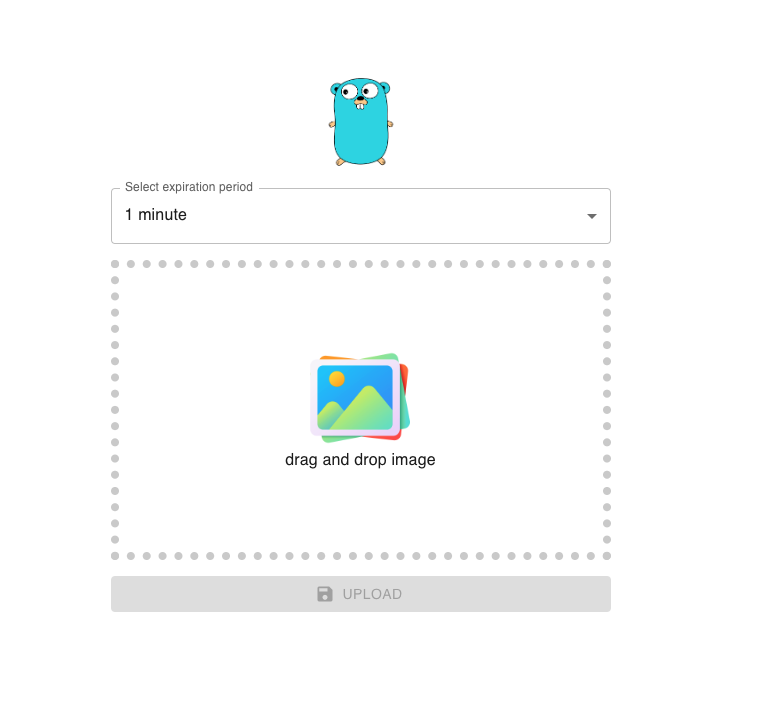

## Quick Start

```bash

# Go inside the directory
cd upload-image-server-client/server
# Install dependencies
npm install

# Start backend development server
npm run develop

# Go inside the directory
cd upload-image-server-client/client

# Install dependencies
npm install

# Start frontend development server
npm start

```

